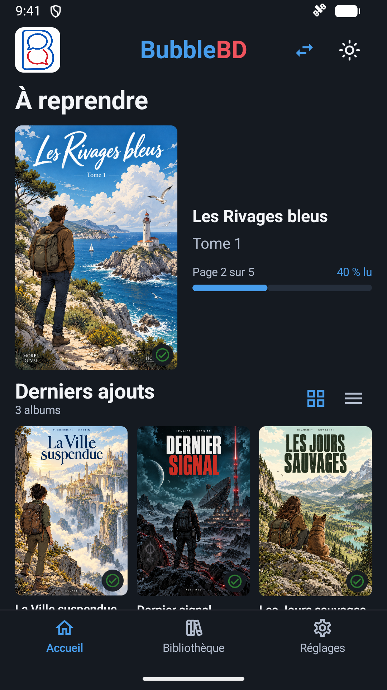
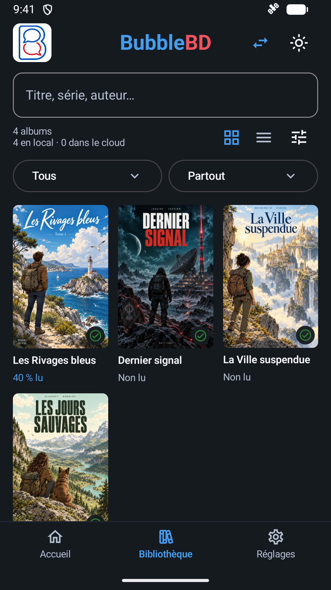
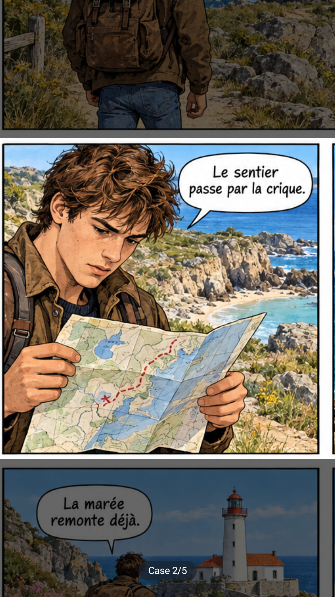

# BubbleBD

**Vos BD, à votre rythme. Même sur un petit écran.**

BubbleBD est un lecteur Android gratuit et open source pour votre collection personnelle. Ouvrez un album, passez d'une case à l'autre et retrouvez votre lecture là où vous l'avez laissée.

**[Télécharger la bêta Android](https://github.com/AntoineViallefont/BubbleBD/releases/tag/v0.3.32-beta.1)** · **[Devenir testeur](https://github.com/AntoineViallefont/BubbleBD/issues/new?template=tester.yml)** · [Signaler un problème](https://github.com/AntoineViallefont/BubbleBD/issues/new?template=bug.yml) · [Proposer une idée](https://github.com/AntoineViallefont/BubbleBD/issues/new?template=feature.yml)

*Captures réelles de l'application sur émulateur. Albums et illustrations de démonstration fictifs ; aucune BD privée n'est distribuée.*

## Ce que vous pouvez faire

- **Lire case par case** grâce à une détection automatique effectuée sur le téléphone. Double toucher pour passer de la page à une case ; zoom et déplacement disponibles.
- **Retrouver votre collection** : couvertures, séries regroupées, ordre des tomes, progression et reprise de lecture.
- **Ouvrir vos fichiers PDF, CBZ et CBR**, sur Android 8 ou supérieur avec processeur ARM 64 bits ou x86 64 bits. Les archives chiffrées ou certains fichiers endommagés peuvent ne pas s'ouvrir.
- **Compléter les fiches des albums** depuis des catalogues et sources identifiées. Corrigez une fiche, figez ses informations ou relancez une recherche pour ce titre.
- **Choisir votre confort de lecture** : thèmes clair/sombre, lecture manga et assombrissement autour de la case active.
- **Utiliser OneDrive en option**, avec votre propre compte Microsoft. Aucun compte BubbleBD n'est requis.

L'application est **100 % gratuite, sans publicité ni achat intégré**. Vos fichiers originaux restent intacts. La détection et la lecture des albums disponibles localement fonctionnent sans serveur ; la recherche bibliographique et OneDrive utilisent Internet.

## Nous cherchons des lecteurs pour préparer Google Play

BubbleBD est une bêta. Nous recherchons des volontaires pour essayer l'app sur différents téléphones et raconter leur expérience : ce qui est agréable, ce qui bloque et ce qui manque.

**[Je souhaite participer](https://github.com/AntoineViallefont/BubbleBD/issues/new?template=tester.yml)** — un pseudonyme GitHub suffit. Ne publiez pas votre adresse Google. Un compte GitHub gratuit est nécessaire pour envoyer ce formulaire.

Si suffisamment de lecteurs souhaitent continuer, nous organiserons un test fermé Google Play : au moins 12 testeurs avec leur compte Google, inscrits pendant 14 jours consécutifs et utilisant réellement l'app. **Ce test n'est pas encore ouvert.** Les essais de la bêta GitHub ne comptent pas dans ces 14 jours. Le projet pourra rester sur GitHub si l'intérêt ne justifie pas une publication sur le Play Store.

Vous pouvez simplement essayer la bêta, sans vous engager pour Google Play. Les retours sont publics ; n'y joignez pas de BD complète ni de donnée personnelle. Pour suivre les annonces, choisissez **Watch → Custom → Releases** sur ce dépôt.

## Installer la bêta

1. Ouvrez [la dernière version](https://github.com/AntoineViallefont/BubbleBD/releases/tag/v0.3.32-beta.1) depuis votre téléphone Android.
2. Dans **Assets**, téléchargez `BubbleBD-0.3.32-beta.apk` (pas l'archive du code source).
3. Ouvrez le fichier et autorisez ponctuellement votre navigateur ou gestionnaire de fichiers à installer cette application. Vous pouvez retirer cette autorisation ensuite. Ne désactivez pas Play Protect.
4. Ajoutez un dossier ou un album que vous avez le droit de lire. Aucun album commercial n'est fourni.

La bêta est signée avec la clé de publication BubbleBD. Les futures versions officielles utiliseront la même clé, avec un numéro de version supérieur. Les empreintes de l'APK et du certificat sont indiquées dans chaque publication.

**Anciennes versions Firebase :** la signature a changé. N'essayez pas de remplacer ou de désinstaller votre version de test sans sauvegarde : une désinstallation effacerait la bibliothèque et la progression locales. Les fichiers originaux restent conservés. Il n'existe pas encore d'outil de migration de ces données.

## Limites connues et données

La détection peut manquer des cases, se tromper dans leur ordre ou cadrer imparfaitement une bulle. La lecture en page entière et le zoom restent disponibles. Aucune réussite universelle n'est promise : la dernière mesure privée du moteur comportait encore 15 planches avec des critères en échec sur 61 planches, avec 340 variantes contrôlées ; ce n'est pas une mesure de fiabilité sur toutes les BD.

La recherche bibliographique peut se tromper, être incomplète ou s'arrêter sur un quota. Elle utilise des catalogues publics et un service Mistral commun, dont les crédits sont partagés. Les résultats directs restent locaux ; le service Mistral peut réutiliser des fiches mises en cache. **Les corrections des lecteurs ne constituent pas encore une base collaborative.**

Les titres et indices bibliographiques, et parfois une miniature de couverture, peuvent être envoyés aux services de recherche. La BD complète et la progression ne sont pas transmises au service bibliographique. Consultez [Données et confidentialité](PRIVACY.md) avant d'utiliser ces fonctions.

## Code, contributions et licences

Application Kotlin/Jetpack Compose, détection embarquée LiteRT, lecture d'archives native et services bibliographiques Python/JavaScript. Le code de l'application, du moteur et du service est ouvert. Les secrets et corpus privés sont exclus.

- [Compiler, tester et publier](docs/RELEASING.md)
- [Contribuer et envoyer des retours](CONTRIBUTING.md)
- [Signaler une vulnérabilité en privé](SECURITY.md)
- [Licence AGPL-3.0-or-later](LICENSE) et [crédits des composants et du modèle](NOTICE)

Les dépendances et poids tiers conservent leurs licences. Les fichiers de BD des utilisateurs ne sont pas couverts par la licence du code. Le modèle embarqué est fourni avec sa provenance ; ses données d'entraînement ne sont pas distribuées. La fixture HTML de test éditeur est synthétique ; les notices BnF sont réutilisées sous Licence Ouverte.

## English

BubbleBD is a free, open-source Android reader for your own comics. It combines on-device automatic panel detection, a local library with series and reading progress, PDF/CBZ/CBR support, and sourced book information. Android 8+, ARM64 or x86_64. No BubbleBD account, ads or in-app purchases.

**[Download the Android beta](https://github.com/AntoineViallefont/BubbleBD/releases/tag/v0.3.32-beta.1)** · **[Volunteer to test](https://github.com/AntoineViallefont/BubbleBD/issues/new?template=tester.yml)** · [Report a problem](https://github.com/AntoineViallefont/BubbleBD/issues/new?template=bug.yml)

We are looking for real readers to help improve the app and possibly prepare a Google Play release. The Google Play closed test has not started. Panel detection is imperfect; the shared Mistral metadata service needs Internet and has limited quotas. Read the [privacy information](PRIVACY.md) before using metadata lookup. Comics are not included. Issues are public: do not post private books, personal information or your Google account address. Feedback in English is welcome.
