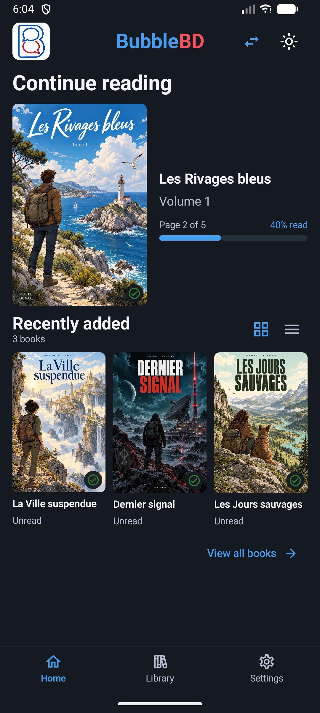
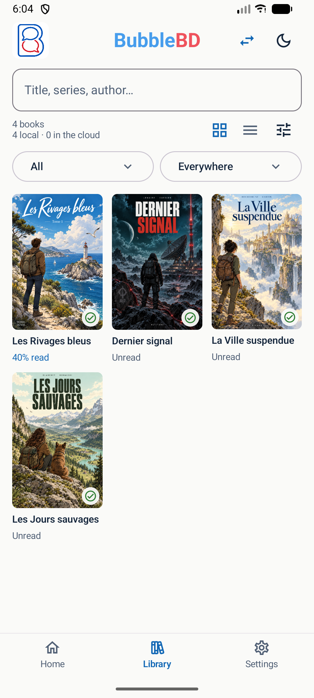
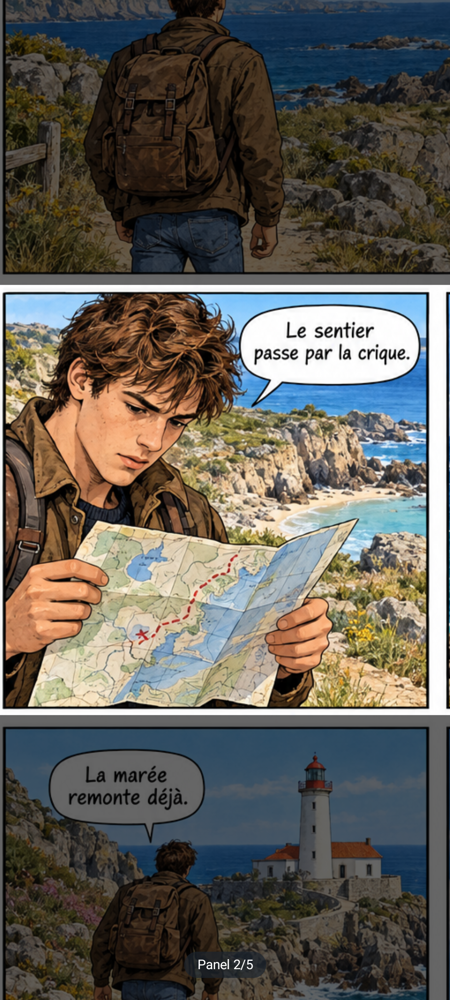

# BubbleBD

**English · [Français](README.fr.md)**

### Your comics. Your pace. Even on a small screen.

BubbleBD is a free, open-source Android reader for your own comic collection. Open a book, move through its panels and pick up where you left off.

**[Download the Android beta](https://github.com/AntoineViallefont/BubbleBD/releases/tag/v0.3.33-beta.1)** · **[Volunteer to test](https://github.com/AntoineViallefont/BubbleBD/issues/new?template=tester.yml)** · [Report a problem](https://github.com/AntoineViallefont/BubbleBD/issues/new?template=bug.yml) · [Suggest an improvement](https://github.com/AntoineViallefont/BubbleBD/issues/new?template=feature.yml)

*Actual emulator screenshots. Demo books and illustrations are fictional. Private comics are never distributed.*

## Made for reading

- **Automatic panel detection on your phone.** Double-tap to switch between a panel and the full page. Pinch and drag when you need a closer look.
- **A library that remembers your place.** Browse covers, grouped series and reading progress.
- **Your own PDF, CBZ and CBR files.** Originals are never changed. Encrypted or damaged archives may not open.
- **Sourced book information.** Look up details, edit a record or lock it to prevent further changes from searches.
- **Reading comfort.** Light and dark themes, right-to-left manga reading and adjustable dimming around the active panel.
- **Android folder access.** Other providers may appear in the folder picker, depending on what they support. Google Drive folder access has not been verified; there is no dedicated Drive integration.
- **Optional OneDrive access** with your own Microsoft account. No BubbleBD account required.

**Free, with no ads or in-app purchases.** Android 8 or newer, ARM64 or x86_64. No commercial comics included.

**English and French interfaces.** BubbleBD follows your phone's language, using English for other languages. On Android 13+, you can also select BubbleBD's language in Android's app settings. Book titles, summaries and personal metadata are not translated.

## Readers wanted — help us prepare for Google Play

This is a beta, and practical feedback matters: what feels comfortable, what gets in the way and what you would like to improve. No technical background is needed.

**[I'd like to help](https://github.com/AntoineViallefont/BubbleBD/issues/new?template=tester.yml)** — your GitHub username is enough. A free GitHub account is needed to submit the form. **Do not post your Google email address:** issues are public.

If enough readers are interested, we will organise a Google Play closed test with at least 12 testers enrolled continuously for 14 days and actively trying the app. **That test has not started.** Time spent using the GitHub beta does not count towards Google's 14-day requirement. You can try this beta without committing to the future Play test. BubbleBD may simply remain on GitHub if there is not enough interest.

Follow releases with **Watch → Custom → Releases**. Report problems and ideas using the links above; please do not attach private books or personal information.

## Install

1. Open the [beta release](https://github.com/AntoineViallefont/BubbleBD/releases/tag/v0.3.33-beta.1) on your Android phone.
2. Under **Assets**, download `BubbleBD-0.3.33-beta.apk`, not the source archive.
3. Open the APK and temporarily allow installation from your browser or file manager. You can revoke that permission afterwards. Do not disable Play Protect.
4. Add a folder containing comics you have the right to read.

**Updating the GitHub beta:** install the new APK over the previous GitHub beta. It uses the same publication key and a higher version code, so uninstalling is unnecessary. Keep your original files available.

**Earlier Firebase testers:** those builds used an Android Debug signature. They cannot be updated directly with this beta. Keep your current installation: uninstalling would erase your local library and progress. Original files are preserved. No migration tool is available yet.

## Honest limits and privacy

Panel detection can miss panels, place them in the wrong order or crop a balloon imperfectly. Full-page reading and zoom remain available. The latest complete private engine baseline had failing criteria on 15 of 61 pages across 340 variants; this is not a success-rate estimate for all comics. This bilingual release does not change the detection algorithm.

Book-information lookup uses public catalogues and a shared Mistral service. It needs Internet, may return incomplete information and has shared quotas. Bibliographic clues and sometimes a cover thumbnail may be sent to these services. Full books and reading progress are not sent to the metadata service. Read the [privacy information](PRIVACY.md).

Direct catalogue results stay local; the Mistral service reuses cached matches. Reader corrections are **not yet a shared, editable community database**. Reading locally available books and detecting panels work without that service.

## Open source

Kotlin / Jetpack Compose application, on-device LiteRT detection, native archive support and Python/JavaScript metadata services. Application and service code are open; private books, reference annotations and credentials are excluded.

- [Build, test and release](docs/RELEASING.md)
- [Contribute and give feedback](CONTRIBUTING.md)
- [Report security issues privately](SECURITY.md)
- [AGPL-3.0-or-later licence](LICENSE) and [third-party notices](NOTICE)

Third-party components and model weights retain their licences. The code licence does not cover users' comics. Training data is not redistributed. The publisher HTML test fixture is synthetic; BnF catalogue fixtures are reused under the French Open Licence.
